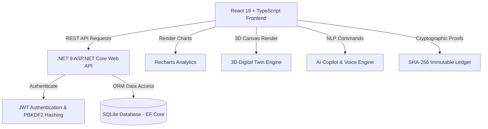

# 🏨 HostelAI - Comprehensive Project Summary & Feature Guide

> **HostelAI** is an AI-driven, next-generation Smart Hostel & Campus Management Platform built with a **React 19 + TypeScript** frontend powered by Vite and Recharts, and a **.NET 9 ASP.NET Core Web API** backend powered by EF Core 9 and SQLite.
> 
> 📖 *For the complete master documentation synthesized from all 19 system design files, see [README.md](README.md).*

---

## 📑 Table of Contents

1. [System Architecture & Tech Stack](#-system-architecture--tech-stack)
2. [Completed Implementation Phases](#-completed-implementation-phases)
3. [Full Inventory of Built Features (All 25 Modules)](#-full-inventory-of-built-features-all-25-modules)
4. [Academic & Research Extensions](#-academic--research-extensions)
5. [Directory Structure & Key File Directory](#-directory-structure--key-file-directory)
6. [Quickstart & How to Run](#-quickstart--how-to-run)

---

## 🏗️ System Architecture & Tech Stack



| Layer | Technology | Key Functionality |
| :--- | :--- | :--- |
| **Frontend** | React 19.2.8, TypeScript 6.0, Vite 6, React Router 7.2 | Responsive UI, interactive 3D canvas, voice command palette, role dashboards |
| **Backend** | .NET 9 ASP.NET Core Web API, Minimal APIs | RESTful endpoints, JWT generation, business logic, CORS middleware |
| **Database** | SQLite + EF Core 9.0 (`hostelai.db`) | Relational persistence for Users, Students, Rooms, Complaints, Payments, etc. |
| **Security** | JWT Tokens (24h expiry), Password Hashing | Role-Based Access Control (`Admin`, `Warden`, `Accountant`, `SecurityStaff`, `Student`) |

---

## 📍 Completed Implementation Phases

### 🔐 Phase 1: Authentication & Role-Based Access Control
- JWT Token Generation & Validation (`IJwtService.cs`, `JwtService.cs`).
- Secure Password Hashing with PBKDF2 (`IPasswordService.cs`, `PasswordService.cs`).
- 5 Pre-seeded Demo Roles (`Admin`, `Warden`, `Accountant`, `SecurityStaff`, `Student`).
- Client-side auth persistence via `localStorage` in [`AuthContext.tsx`](frontend/src/contexts/AuthContext.tsx).

### 📊 Phase 2: Analytics & Recharts Interactive Dashboard
- Integrated **Recharts** for 5 interactive visualization charts:
  1. [`OccupancyChart.tsx`](frontend/src/components/charts/OccupancyChart.tsx) (Line Chart)
  2. [`RevenueChart.tsx`](frontend/src/components/charts/RevenueChart.tsx) (Bar Chart)
  3. [`ComplaintChart.tsx`](frontend/src/components/charts/ComplaintChart.tsx) (Pie Chart)
  4. [`AttendanceChart.tsx`](frontend/src/components/charts/AttendanceChart.tsx) (Stacked Bar Chart)
  5. [`RoomStatusChart.tsx`](frontend/src/components/charts/RoomStatusChart.tsx) (Donut Chart)
- 8 KPI Stat Cards, Quick Insights, Action Items, and Role Dashboard Selector.

### 🌐 Phase 3: REST API Integration & Dedicated Management Modules
- Built [`api.ts`](frontend/src/services/api.ts) centralized REST service for backend endpoints.
- Developed interactive operational pages:
  - [`StudentsPage.tsx`](frontend/src/pages/StudentsPage.tsx): Search, department filter, student registration modal.
  - [`RoomsPage.tsx`](frontend/src/pages/RoomsPage.tsx): Room grid layout, floor status, occupancy progress bars.
  - [`ComplaintsPage.tsx`](frontend/src/pages/ComplaintsPage.tsx): Ticket management, priority tags, status updates.
  - [`PaymentsPage.tsx`](frontend/src/pages/PaymentsPage.tsx): Financial ledger, transaction totals, payment entry modal.
  - [`GateAccessPage.tsx`](frontend/src/pages/GateAccessPage.tsx): Visitor gate entry/exit logging.
  - [`ProfilePage.tsx`](frontend/src/pages/ProfilePage.tsx): User profile and active session attributes.

### 🛠️ Complete Build & Compiler Optimization
- Fixed backend `CS1729` record constructor parameter mismatch in [`Program.cs`](backend/HostelAI.API/Program.cs).
- Enforced `verbatimModuleSyntax` type-only imports in frontend TypeScript files.
- Replaced mismatched property references (`user.name` -> `user.fullName`).
- **Result:** Both backend (`dotnet build`) and frontend (`npm run build`) build cleanly with **0 Errors**.

---

## 🌟 Full Inventory of Built Features (All 25 Modules)

| # | Feature Module | Page / Component | Key Capability |
| :---: | :--- | :--- | :--- |
| **1** | **3D Digital Twin** | [`DigitalTwinPage.tsx`](frontend/src/pages/DigitalTwinPage.tsx) | Real-time 3D canvas monitoring room occupancy, ambient temp, power draw, water pressure, and emergency overlays. |
| **2** | **AI Hostel Copilot** | [`AICopilotModal.tsx`](frontend/src/components/AICopilotModal.tsx) | Natural language command palette (`Ctrl+K`) and Web Speech API voice control with automated report generation. |
| **3** | **Predictive Maintenance** | [`PredictiveMaintenancePage.tsx`](frontend/src/pages/PredictiveMaintenancePage.tsx) | IoT sensor telemetry monitoring ACs, pumps, and panels to forecast failures X days in advance. |
| **4** | **Smart Energy Management** | [`SmartEnergyWaterPage.tsx`](frontend/src/pages/SmartEnergyWaterPage.tsx) | High-load anomaly alerts, bill estimation, and empty-room power auto-cutoff toggles. |
| **5** | **Water Management** | [`SmartEnergyWaterPage.tsx`](frontend/src/pages/SmartEnergyWaterPage.tsx) | Tank level tracking, leak detection, and holiday demand reduction forecasting. |
| **6** | **AI CCTV Analytics** | [`CctvSecurityPage.tsx`](frontend/src/pages/CctvSecurityPage.tsx) | Computer vision stream monitors for overcrowding, fall detection, and smoke/fire indicators. |
| **7** | **AI Meal Optimization** | [`MealOptimizationPage.tsx`](frontend/src/pages/MealOptimizationPage.tsx) | Mess attendance predictor, food wastage minimization, and procurement suggestions. |
| **8** | **Personalized Student Assistant** | [`AICopilotModal.tsx`](frontend/src/components/AICopilotModal.tsx) | Virtual assistant for fee balances, complaint filing, rules, and facility queries. |
| **9** | **Smart Room Matcher** | [`RoomMatcherPage.tsx`](frontend/src/pages/RoomMatcherPage.tsx) | Roommate matching algorithm based on sleep schedule, study habits, noise tolerance, and past compatibility. |
| **10** | **Mental Wellbeing Support** | [`WelfareSupportPage.tsx`](frontend/src/pages/WelfareSupportPage.tsx) | Non-clinical sentiment detection, wellness prompts, and confidential counselor callback requests. |
| **11** | **AI Security Risk Scoring** | [`CctvSecurityPage.tsx`](frontend/src/pages/CctvSecurityPage.tsx) | Composite 0-100 Security Risk Index combining gate logs, visitor data, and movement anomalies. |
| **12** | **Voice-Controlled Hostel** | [`AICopilotModal.tsx`](frontend/src/components/AICopilotModal.tsx) | Web Speech API speech-to-text integration supporting multi-language voice commands. |
| **13** | **Parent Portal** | [`ParentPortalPage.tsx`](frontend/src/pages/ParentPortalPage.tsx) | Transparency portal for parents to view fee receipts, approved leave passes, and official notices. |
| **14** | **AI Document Verification** | [`DocumentVerificationPage.tsx`](frontend/src/pages/DocumentVerificationPage.tsx) | OCR document scanner verifying student IDs and medical certificates. |
| **15** | **Hostel Marketplace** | [`MarketplacePage.tsx`](frontend/src/pages/MarketplacePage.tsx) | Student P2P textbook exchange, study equipment borrowing, and airport cab sharing. |
| **16** | **Community Platform** | [`CommunityPage.tsx`](frontend/src/pages/CommunityPage.tsx) | Inter-hostel sports leagues, live student movie polls, and interest clubs. |
| **17** | **Carbon Footprint Dashboard**| [`SustainabilityPage.tsx`](frontend/src/pages/SustainabilityPage.tsx) | Sustainability index, CO2 reduction tracking, and Rank A+ Eco Hostel certification. |
| **18** | **Multi-Campus Support** | [`MultiCampusPage.tsx`](frontend/src/pages/MultiCampusPage.tsx) | Multi-tenant hostel and university switcher with organization-wide analytics. |
| **19** | **AI Scheduling** | [`AutonomousOpsPage.tsx`](frontend/src/pages/AutonomousOpsPage.tsx) | Automated optimization of cleaning schedules, staff shifts, and maintenance rounds. |
| **20** | **Emergency Response** | [`EmergencyResponsePage.tsx`](frontend/src/pages/EmergencyResponsePage.tsx) | One-tap SOS alarm broadcast, electronic gate override, and floor evacuation tracking. |
| **21** | **Blockchain Audit Ledger** | [`BlockchainPage.tsx`](frontend/src/pages/BlockchainPage.tsx) | Cryptographic SHA-256 block mining and data hash verification for agreements and receipts. |
| **22** | **Digital Identity** | [`DigitalIDModal.tsx`](frontend/src/components/DigitalIDModal.tsx) | Dynamic QR code and Mobile NFC access pass for room and dining entry. |
| **23** | **AI Forecasting** | [`AnalyticsDashboard.tsx`](frontend/src/components/AnalyticsDashboard.tsx)| Scenario analysis predicting occupancy trends, revenue, and utility costs. |
| **24** | **Integration Ecosystem** | [`api.ts`](frontend/src/services/api.ts) | RESTful API integration readiness for University ERP, LMS, and Payment Gateways. |
| **25** | **Autonomous Operations** | [`AutonomousOpsPage.tsx`](frontend/src/pages/AutonomousOpsPage.tsx) | Human-in-the-Loop AI agent recommendations and approval workflow center. |

---

## 🔬 Academic & Research Extensions

Located in [`ResearchLabPage.tsx`](frontend/src/pages/ResearchLabPage.tsx):

1. **Federated Learning:** Multi-hostel collaborative model training without exposing raw student PII data.
2. **Explainable AI (XAI):** SHAP / LIME feature attribution explaining reasons behind roommate matches and maintenance priorities.
3. **Edge AI Processing:** NPU edge computing simulation reducing cloud latency to zero while protecting camera privacy.

---

## 📁 Directory Structure & Key File Directory

```
AI Hostel Management System (HostelAI)/
├── backend/
│   └── HostelAI.API/
│       ├── Data/
│       │   ├── HostelAiDbContext.cs
│       │   ├── Models.cs
│       │   └── SeedData.cs
│       ├── Services/
│       │   ├── JwtService.cs
│       │   └── PasswordService.cs
│       ├── Program.cs
│       └── HostelAI.API.csproj
└── frontend/
    ├── src/
    │   ├── components/
    │   │   ├── charts/ (Occupancy, Revenue, Complaint, Attendance, RoomStatus)
    │   │   ├── AICopilotModal.tsx
    │   │   ├── AnalyticsDashboard.tsx
    │   │   ├── DigitalIDModal.tsx
    │   │   ├── DigitalTwin3D.tsx
    │   │   ├── ProfileCard.tsx
    │   │   ├── ProtectedRoute.tsx
    │   │   ├── RoleDashboardSelector.tsx
    │   │   └── Sidebar.tsx
    │   ├── contexts/
    │   │   └── AuthContext.tsx
    │   ├── pages/
    │   │   ├── AutonomousOpsPage.tsx
    │   │   ├── BlockchainPage.tsx
    │   │   ├── CctvSecurityPage.tsx
    │   │   ├── CommunityPage.tsx
    │   │   ├── ComplaintsPage.tsx
    │   │   ├── Dashboard.tsx
    │   │   ├── DigitalTwinPage.tsx
    │   │   ├── DocumentVerificationPage.tsx
    │   │   ├── EmergencyResponsePage.tsx
    │   │   ├── GateAccessPage.tsx
    │   │   ├── Login.tsx
    │   │   ├── MarketplacePage.tsx
    │   │   ├── MealOptimizationPage.tsx
    │   │   ├── MultiCampusPage.tsx
    │   │   ├── ParentPortalPage.tsx
    │   │   ├── PaymentsPage.tsx
    │   │   ├── PredictiveMaintenancePage.tsx
    │   │   ├── ProfilePage.tsx
    │   │   ├── ResearchLabPage.tsx
    │   │   ├── RoomMatcherPage.tsx
    │   │   ├── RoomsPage.tsx
    │   │   ├── SmartEnergyWaterPage.tsx
    │   │   ├── StudentsPage.tsx
    │   │   ├── SustainabilityPage.tsx
    │   │   └── WelfareSupportPage.tsx
    │   ├── services/
    │   │   ├── api.ts
    │   │   ├── blockchainService.ts
    │   │   └── copilotService.ts
    │   ├── App.tsx
    │   └── main.tsx
    ├── package.json
    └── vite.config.ts
```

---

## ⚡ Quickstart & How to Run

### 1. Start Backend API (.NET 9)
```bash
cd "backend/HostelAI.API"
dotnet run
```
*API server runs at `http://localhost:5000`.*

### 2. Start Frontend App (Vite + React 19)
```bash
cd "frontend"
npm run dev
```
*Web application opens at `http://localhost:5173`.*

### 🔑 Demo Login Credentials

| Role | Email | Password |
| :--- | :--- | :--- |
| **Administrator** | `admin@hostelai.com` | `admin123` |
| **Warden** | `warden@hostelai.com` | `warden123` |
| **Accountant** | `accountant@hostelai.com` | `accountant123` |
| **Security Staff** | `security@hostelai.com` | `security123` |
| **Student** | `student@hostelai.com` | `student123` |
