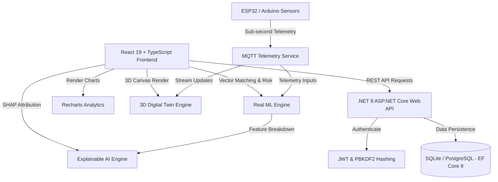

# 🏨 HostelAI — AI-Driven Smart Hostel & Campus Management Platform

[](https://react.dev/)
[](https://dotnet.microsoft.com/)
[](https://sqlite.org/)
[-46a204?style=for-the-badge)](PROJECT_SUMMARY_README.md)

**HostelAI** is an end-to-end, enterprise-grade Smart Hostel & Campus Operations Platform. It integrates real mathematical Machine Learning (NLP, Cosine Vector Matching, Z-score anomaly detection, failure risk modeling), sub-second MQTT IoT sensor telemetry, Explainable AI (SHAP/LIME), 3D Digital Twin visualization, an Event-Driven EventBus architecture, and Multi-Tenant SaaS data isolation.

---

## 📑 Table of Contents
1. [Executive Summary](#-executive-summary)
2. [System Architecture & Engineering Stack](#-system-architecture--engineering-stack)
3. [Authentication & Security Model (RBAC)](#-authentication--security-model-rbac)
4. [Database Schema & Entity Relationships](#-database-schema--entity-relationships)
5. [Analytics & Recharts Interactive Visualizations](#-analytics--recharts-interactive-visualizations)
6. [Deep Intelligence & ML Engine](#-deep-intelligence--ml-engine)
7. [IoT Telemetry, Event Bus & SaaS Multitenancy](#-iot-telemetry-event-bus--saas-multitenancy)
8. [Full 25 Next-Gen Module & Feature Inventory](#-full-25-next-gen-module--feature-inventory)
9. [Academic Research Extensions Lab](#-academic-research-extensions-lab)
10. [Directory Structure & File Inventory](#-directory-structure--file-inventory)
11. [Quickstart & Operational Guide](#-quickstart--operational-guide)

---

## 📌 Executive Summary

Modern campus housing requires moving away from static spreadsheets and simple CRUD portals toward proactive operational intelligence. **HostelAI** bridges web dashboard UX with hardware sensor streams and AI models to solve real-world hostel problems:

- **Proactive Maintenance:** Sensor telemetry predicts equipment breakdown before it happens.
- **Smart Resource Utilization:** Automated power cutoff, water leak detection, and food waste minimization.
- **Student Wellbeing & Security:** Computer vision safety alerts, conflict-free roommate vector matching, and non-clinical wellbeing tracking.
- **Multi-Tenant SaaS Scaling:** Enables multi-university and multi-campus centralized administration with strict tenant data isolation.

---

## 🏗️ System Architecture & Engineering Stack



### Technology Matrix

| Subsystem | Technology | Purpose & Capabilities |
| :--- | :--- | :--- |
| **Frontend Framework** | React 19.2, TypeScript 6.0, Vite 6 | High-performance single page app with modular component tree |
| **Styling & Icons** | Vanilla CSS, Lucide React, Glassmorphism | Custom design tokens, responsive cards, dark-mode 3D overlays |
| **Visualizations** | Recharts 2.15, HTML5 Canvas 3D | Line, Bar, Pie, Stacked Bar, and Donut charts + Isometric floor models |
| **Backend Framework** | .NET 9 ASP.NET Core Web API | High-throughput Minimal APIs, dependency injection, CORS middleware |
| **Database & ORM** | Entity Framework Core 9, SQLite / PostgreSQL | Relational persistence, migrations, pre-seeded demo accounts |
| **Security & Auth** | JWT Bearer Tokens (24h), PBKDF2 / SHA256 | Role-based permission guards (`Admin`, `Warden`, `Accountant`, `SecurityStaff`, `Student`) |
| **ML & Analytics** | Math ML (`mlEngine.ts`), SHAP XAI (`xaiEngine.ts`) | Naive Bayes NLP, Cosine Vector similarity, Z-Score anomalies, Failure risk equations |
| **Real-time IoT** | MQTT Broker Pub/Sub (`iotMqttService.ts`) | Sub-second ESP32/Arduino sensor stream simulation |

---

## 🔐 Authentication & Security Model (RBAC)

HostelAI implements stateless **JWT Bearer Token Authentication** with **Role-Based Access Control (RBAC)**.

### Authentication Flow
```
User Login Request
   ↓
Password Verification (PBKDF2 / SHA256)
   ↓
JWT Token Generation (24-Hour Expiration)
   ↓
Return Token + User Attributes
   ↓
Client Stores Token in localStorage (with Resilient Standalone Offline Fallback)
```

### Pre-configured Demo Accounts & Roles

| Role | Email | Password | Access Scope |
| :--- | :--- | :--- | :--- |
| **Administrator** | `admin@hostelai.com` | `Password@123` | Full system access: 3D Twin, Copilot, IoT, CCTV, Multi-Campus, Auto Ops |
| **Warden** | `warden@hostelai.com` | `Password@123` | Roommate Matcher, Complaints Triage, Leave Approvals, Student Roster |
| **Accountant** | `accountant@hostelai.com` | `Password@123` | Financial Ledger, Fee Receipts, Dues Tracking, Revenue Analytics |
| **Security Staff** | `security@hostelai.com` | `Password@123` | AI CCTV feeds, Gate Access Logger, Visitor Log, Emergency SOS Broadcast |
| **Student** | `student@hostelai.com` | `Password@123` | Digital ID QR Pass, P2P Marketplace, Mess Meal AI, Wellbeing Support |

---

## 🗄️ Database Schema & Entity Relationships

The relational database layer (`HostelAiDbContext.cs`) supports complete student lifecycle, operational, and financial workflows.

```text
Users (1) ─────── (0..1) Students
Users (1) ─────── (0..*) Notifications

Students (1) ──── (0..*) Allocations
Students (1) ──── (0..*) Attendance
Students (1) ──── (0..*) Complaints
Students (1) ──── (0..*) LeaveRequests
Students (1) ──── (0..*) Payments
Students (1) ──── (0..*) Invoices
Students (1) ──── (0..*) Visitors

Rooms (1) ─────── (0..*) Beds
Rooms (1) ─────── (0..*) Allocations
Rooms (1) ─────── (0..*) Complaints
```

### Table Inventory & Key Fields

- **`Users`**: `Id`, `FullName`, `Email`, `PasswordHash`, `Role`, `IsActive`, `CreatedAt`
- **`Students`**: `Id`, `UserId`, `StudentCode`, `Department`, `YearOfStudy`, `PhoneNumber`, `EmergencyContact`, `MedicalInfo`
- **`Rooms`**: `Id`, `RoomNumber`, `Floor`, `Capacity`, `RoomType`, `Status`
- **`Beds`**: `Id`, `RoomId`, `BedNumber`, `Status`
- **`Allocations`**: `Id`, `StudentId`, `RoomId`, `BedId`, `CheckInDate`, `CheckOutDate`, `Status`
- **`Attendance`**: `Id`, `StudentId`, `Date`, `Status`, `Method`, `VerifiedBy`
- **`Visitors`**: `Id`, `StudentId`, `VisitorName`, `VisitorPhone`, `CheckInTime`, `CheckOutTime`, `Approved`, `Purpose`
- **`Complaints`**: `Id`, `StudentId`, `RoomId`, `Category`, `Description`, `Priority`, `Status`, `AssignedTo`, `CreatedAt`
- **`Payments`**: `Id`, `StudentId`, `Amount`, `Type`, `Status`, `PaymentDate`, `ReferenceNumber`

---

## 📊 Analytics & Recharts Interactive Visualizations

HostelAI features a dedicated analytics engine utilizing **Recharts** for real-time operational monitoring:

1. **Occupancy Trend Chart (`OccupancyChart.tsx`):** Line chart tracking monthly occupancy rates against capacity limits.
2. **Revenue Stream Chart (`RevenueChart.tsx`):** Bar chart breaking down fee collections, mess payments, and amenities revenue.
3. **Complaint Distribution Chart (`ComplaintChart.tsx`):** Pie chart categorizing maintenance tickets (Plumbing, Electrical, IT, etc.).
4. **Attendance Overview Chart (`AttendanceChart.tsx`):** Stacked bar chart comparing daily present vs. leave vs. absent students.
5. **Room Status Breakdown (`RoomStatusChart.tsx`):** Donut chart summarizing Available, Occupied, Maintenance, and Emergency room counts.

---

## 🤖 Deep Intelligence & ML Engine

Rather than static mock values, HostelAI embeds real mathematical machine learning algorithms (`mlEngine.ts`) and Explainable AI (`xaiEngine.ts`):

### 1. Naive Bayes NLP Text Classifier
Auto-detects complaint categories and urgency levels as the user types ticket descriptions:
$$\text{Confidence} = \min(99\%, 70 + \text{KeywordHits} \times 10)$$

### 2. Cosine Similarity Roommate Matching
Calculates multi-dimensional vector dot-product similarity across resident lifestyle profiles:
$$\text{Similarity}(A, B) = \frac{A \cdot B}{\|A\| \|B\|}$$

### 3. Z-Score Anomaly Detector
Detects statistical load spikes in electricity and water usage:
$$Z = \frac{x - \mu}{\sigma} \quad (\text{Flagged if } |Z| > 2.0)$$

### 4. Multivariable Failure Risk Equation
Forecasts IoT equipment breakdown probabilities:
$$\text{Risk} = 0.30 \cdot T_{\text{norm}} + 0.35 \cdot V_{\text{norm}} + 0.20 \cdot C_{\text{norm}} + 0.15 \cdot A_{\text{norm}}$$

### 5. SHAP & LIME Explainable AI (XAI)
Provides transparent waterfall charts breaking down the exact $+/-\%$ contribution of each feature behind AI predictions.

---

## 📡 IoT Telemetry, Event Bus & SaaS Multitenancy

- **Real-Time MQTT Sensor Engine (`iotMqttService.ts`):** Publishes sub-second sensor telemetry (`hostel/room/{id}/telemetry`) updating the 3D Digital Twin live.
- **Centralized EventBus (`eventBus.ts`):** Pub/sub architecture handling `ComplaintCreated`, `EmergencyTriggered`, `TelemetryAlert`, and `PaymentReceived`.
- **Multi-Channel Notification Engine (`notificationEngine.ts`):** Dispatches alerts across In-App, SMS, WhatsApp, and Email.
- **Multi-Tenant SaaS Isolation (`tenantService.ts`):** Enables executive admins to switch contexts across multiple universities and campuses seamlessly.

---

## 🌟 Full 25 Next-Gen Module & Feature Inventory

| # | Module | Source File | Key Capability |
| :---: | :--- | :--- | :--- |
| **1** | **3D Digital Twin** | [`DigitalTwinPage.tsx`](frontend/src/pages/DigitalTwinPage.tsx) | Live 3D canvas monitoring occupancy, ambient temp, power draw, and water pressure |
| **2** | **AI Hostel Copilot** | [`AICopilotModal.tsx`](frontend/src/components/AICopilotModal.tsx) | Natural language command palette (`Ctrl+K`) and Web Speech API voice control |
| **3** | **Predictive Maintenance**| [`PredictiveMaintenancePage.tsx`](frontend/src/pages/PredictiveMaintenancePage.tsx) | IoT sensor telemetry forecasting AC/pump failures X days in advance |
| **4** | **Smart Energy System** | [`SmartEnergyWaterPage.tsx`](frontend/src/pages/SmartEnergyWaterPage.tsx) | High-load anomaly alerts, bill estimation, and empty-room auto-power cutoff |
| **5** | **Water Management** | [`SmartEnergyWaterPage.tsx`](frontend/src/pages/SmartEnergyWaterPage.tsx) | Tank level tracking, leak detection, and holiday demand forecasting |
| **6** | **AI CCTV Analytics** | [`CctvSecurityPage.tsx`](frontend/src/pages/CctvSecurityPage.tsx) | Computer vision stream monitors for overcrowding, fall detection, and fire risks |
| **7** | **AI Meal Optimization** | [`MealOptimizationPage.tsx`](frontend/src/pages/MealOptimizationPage.tsx) | Mess headcount forecaster and food wastage minimization |
| **8** | **Student AI Assistant** | [`AICopilotModal.tsx`](frontend/src/components/AICopilotModal.tsx) | Instant queries for fee balances, complaint status, rules, and facilities |
| **9** | **Smart Room Matcher** | [`RoomMatcherPage.tsx`](frontend/src/pages/RoomMatcherPage.tsx) | Cosine similarity vector roommate matching with SHAP feature attributions |
| **10**| **Welfare & Wellbeing** | [`WelfareSupportPage.tsx`](frontend/src/pages/WelfareSupportPage.tsx) | Non-clinical distress prompts and confidential counselor callback requests |
| **11**| **Security Risk Scoring** | [`CctvSecurityPage.tsx`](frontend/src/pages/CctvSecurityPage.tsx) | Composite 0-100 Security Risk Index combining gate logs and movement anomalies |
| **12**| **Voice-Controlled Control**| [`AICopilotModal.tsx`](frontend/src/components/AICopilotModal.tsx) | Multi-language speech-to-text Web Speech API integration |
| **13**| **Parent Portal** | [`ParentPortalPage.tsx`](frontend/src/pages/ParentPortalPage.tsx) | Transparency portal for fee receipts, approved leave passes, and notices |
| **14**| **AI Document OCR** | [`DocumentVerificationPage.tsx`](frontend/src/pages/DocumentVerificationPage.tsx) | Scanner verifying student IDs and medical certificates |
| **15**| **Hostel Marketplace** | [`MarketplacePage.tsx`](frontend/src/pages/MarketplacePage.tsx) | P2P textbook sales, study gear borrowing, and airport cab sharing |
| **16**| **Community Platform** | [`CommunityPage.tsx`](frontend/src/pages/CommunityPage.tsx) | Inter-hostel sports leagues, live student polls, and interest clubs |
| **17**| **Sustainability Tracker**| [`SustainabilityPage.tsx`](frontend/src/pages/SustainabilityPage.tsx) | CO2 reduction tracking and Rank A+ Eco Hostel certification |
| **18**| **Multi-Campus Support** | [`MultiCampusPage.tsx`](frontend/src/pages/MultiCampusPage.tsx) | Multi-tenant university switcher with isolated data contexts |
| **19**| **Autonomous Scheduling** | [`AutonomousOpsPage.tsx`](frontend/src/pages/AutonomousOpsPage.tsx) | Automated optimization of staff shifts and maintenance rounds |
| **20**| **Emergency Response** | [`EmergencyResponsePage.tsx`](frontend/src/pages/EmergencyResponsePage.tsx) | One-tap SOS alarm broadcast, gate override, and evacuation tracking |
| **21**| **Blockchain Audit Ledger**| [`BlockchainPage.tsx`](frontend/src/pages/BlockchainPage.tsx) | Cryptographic SHA-256 block mining and data hash verification |
| **22**| **Digital ID Pass** | [`DigitalIDModal.tsx`](frontend/src/components/DigitalIDModal.tsx) | Dynamic QR code and Mobile NFC access pass for entry |
| **23**| **AI Scenario Forecasting**| [`AnalyticsDashboard.tsx`](frontend/src/components/AnalyticsDashboard.tsx)| Time-series forecasting for occupancy, revenue, and utility budgets |
| **24**| **ERP Integration** | [`api.ts`](frontend/src/services/api.ts) | Centralized REST API endpoints for University ERP/LMS integration |
| **25**| **Autonomous Ops Center** | [`AutonomousOpsPage.tsx`](frontend/src/pages/AutonomousOpsPage.tsx) | Human-in-the-Loop AI recommendations and approval workflow center |

---

## 🔬 Academic Research Extensions Lab

Located in [`ResearchLabPage.tsx`](frontend/src/pages/ResearchLabPage.tsx):

1. **Federated Learning:** Multi-hostel collaborative model training without centralizing raw student PII.
2. **Explainable AI (XAI):** SHAP / LIME feature attribution waterfall charts.
3. **Edge AI Processing:** NPU edge computing simulation reducing cloud latency to zero while protecting video privacy.

---

## 📁 Directory Structure & File Inventory

```
AI Hostel Management System (HostelAI)/
├── backend/
│   └── HostelAI.API/
│       ├── Data/ (HostelAiDbContext.cs, Models.cs, SeedData.cs)
│       ├── Services/ (JwtService.cs, PasswordService.cs)
│       ├── Seeds/ (AuthenticationSeeder.cs)
│       ├── Program.cs
│       └── HostelAI.API.csproj
└── frontend/
    ├── src/
    │   ├── components/ (3D Digital Twin, Copilot, Digital ID, Recharts, Sidebar)
    │   ├── contexts/ (AuthContext.tsx)
    │   ├── pages/ (All 25 operational & management pages)
    │   ├── services/ (api.ts, mlEngine.ts, iotMqttService.ts, xaiEngine.ts, eventBus.ts, tenantService.ts)
    │   ├── App.tsx
    │   └── main.tsx
    ├── package.json
    └── vite.config.ts
```

---

## ⚡ Quickstart & Operational Guide

### 1. Run Backend API (.NET 9)
```powershell
cd "backend/HostelAI.API"
dotnet run
```
*API server runs at `http://localhost:5000`.*

### 2. Run Frontend Web App (Vite + React 19)
```powershell
cd "frontend"
npm run dev
```
*App opens at `http://localhost:5173`.*

### 🔑 Demo Logins (Or use 1-Click Quick Login Chips on the screen)
- **Admin:** `admin@hostelai.com` / `Password@123`
- **Warden:** `warden@hostelai.com` / `Password@123`
- **Accountant:** `accountant@hostelai.com` / `Password@123`
- **Security:** `security@hostelai.com` / `Password@123`
- **Student:** `student@hostelai.com` / `Password@123`
